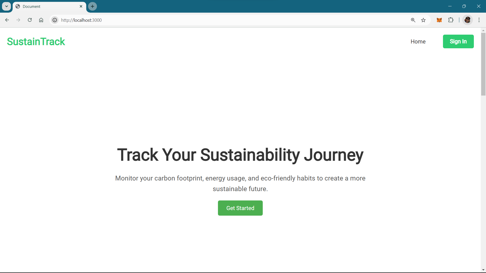
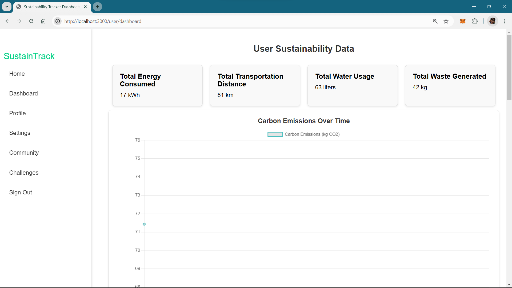
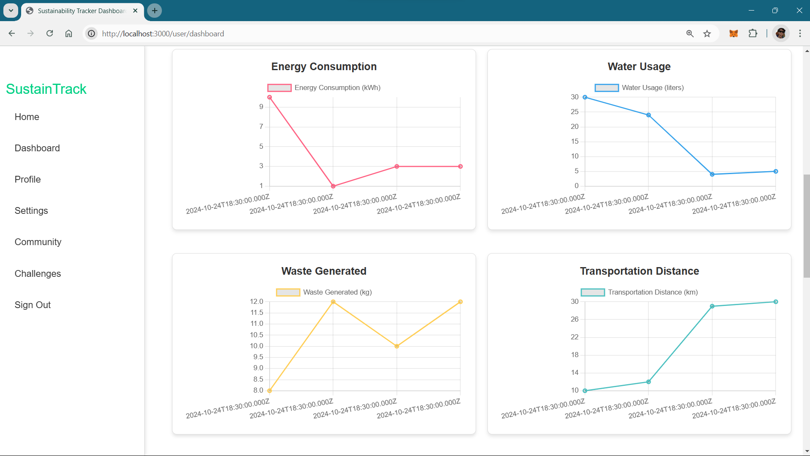
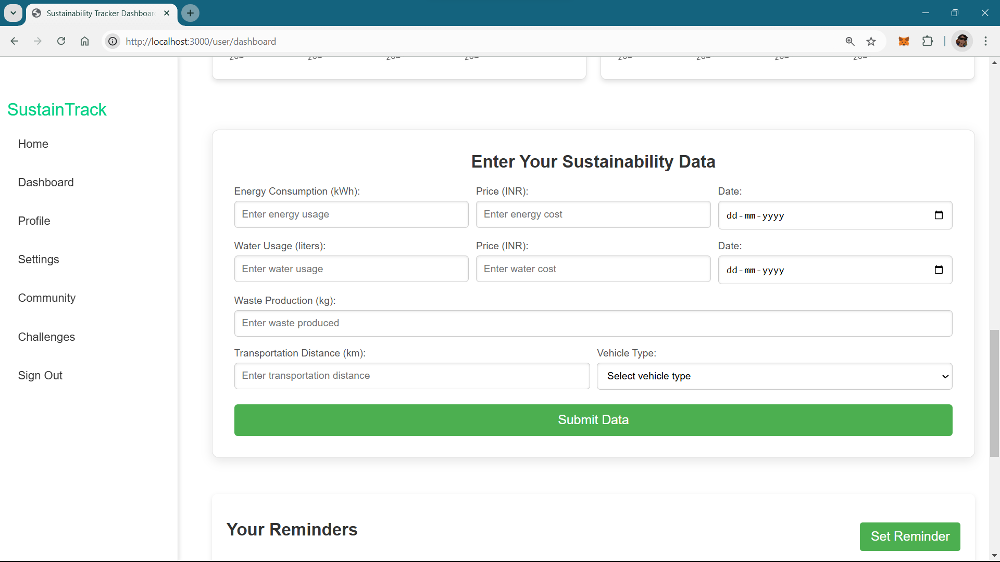

# Sustainability Tracker 🌱

A web application developed to help users monitor and improve their sustainability habits, aiming to reduce their carbon footprint and encourage eco-friendly practices.

## About the Project

The Sustainability Tracker provides an intuitive platform for users to log and view metrics on their sustainability habits, such as energy use, water consumption, waste production, and transportation. By providing visualizations and actionable recommendations, the platform aims to encourage users to make environmentally conscious choices.

## Features
* **User Authentication**: Secure registration and login functionality.
* **Dashboard**: Centralized display of user sustainability data.
* **Data Input**: Simple forms for users to add their sustainability metrics.
* **Analytics & Insights**: Charts and graphs to help users see trends and make informed decisions.
* **Gamification**: Rewards for users who achieve sustainability goals.
## Tech Stack

**Frontend**: HTML, CSS, JavaScript

**Backend**: Node.js, Express.js

**Database**: MySQL

**Data Visualization**: Chart.js

## Run Locally

Clone the repository:
```bash
git clone https://github.com/your-username/sustainability-tracker.git
```
Install dependencies:
```bash
cd sustainability-tracker
npm install
```
Run the application:
```bash
npm start
```

## Environment Variables

To run this project, you will need to add the following environment variables to your .env file

`MYSQL_HOST = 'localhost'`

`MYSQL_USER = 'your_username_here'`

`MYSQL_PASSWORD = 'your_password_here'`

`MYSQL_DATABASE = 'your_dbname_here'`

`PORT = port_number_here`
## Note

create database locally for proper functioning of application

### Database Schema 
* users
```
CREATE TABLE users (
    user_id INT AUTO_INCREMENT PRIMARY KEY,
    username VARCHAR(50) NOT NULL UNIQUE,
    email VARCHAR(100) NOT NULL UNIQUE,
    password VARCHAR(255) NOT NULL,
    role VARCHAR(50) DEFAULT 'user',
    created_at TIMESTAMP DEFAULT CURRENT_TIMESTAMP
);
```
* sustainability data
```
CREATE TABLE sustainability_data (
    id INT AUTO_INCREMENT PRIMARY KEY,
    user_id INT NOT NULL,
    energy_consumption FLOAT,
    energy_price FLOAT,
    energy_date DATE,
    water_usage FLOAT,
    water_price FLOAT,
    water_date DATE,
    waste_production FLOAT,
    transportation_mode VARCHAR(50),
    transportation_distance FLOAT,
    carbon_emissions FLOAT,
    date TIMESTAMP DEFAULT CURRENT_TIMESTAMP,
    FOREIGN KEY (user_id) REFERENCES users(user_id)
);
```
* reminders
```
CREATE TABLE reminders (
    id INT AUTO_INCREMENT PRIMARY KEY,
    user_id INT NOT NULL,
    title VARCHAR(255) NOT NULL,
    description TEXT,
    due_date DATETIME NOT NULL,
    status ENUM('pending', 'completed') DEFAULT 'pending',
    created_at TIMESTAMP DEFAULT CURRENT_TIMESTAMP,
    updated_at TIMESTAMP DEFAULT CURRENT_TIMESTAMP ON UPDATE CURRENT_TIMESTAMP,
    FOREIGN KEY (user_id) REFERENCES users(user_id)
);
```
* articles
```
CREATE TABLE articles (
    id INT AUTO_INCREMENT PRIMARY KEY,
    user_id INT NOT NULL,
    title VARCHAR(255) NOT NULL,
    content TEXT NOT NULL,
    created_at TIMESTAMP DEFAULT CURRENT_TIMESTAMP,
    FOREIGN KEY (user_id) REFERENCES users(user_id)
);
```
## Screenshots






## Authors

- [@N1nadLad](https://github.com/N1nadLad)


